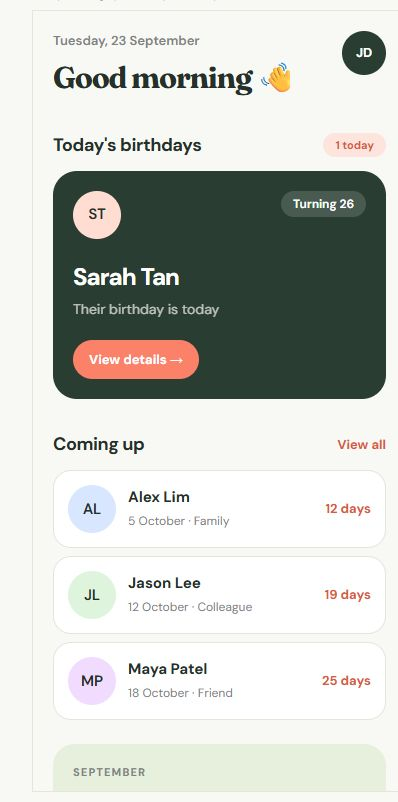
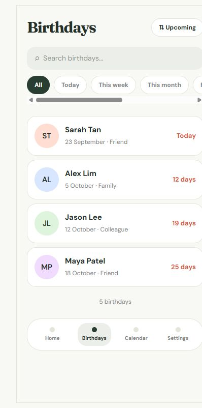
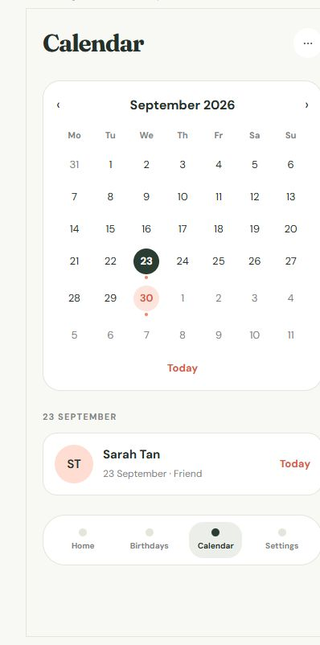
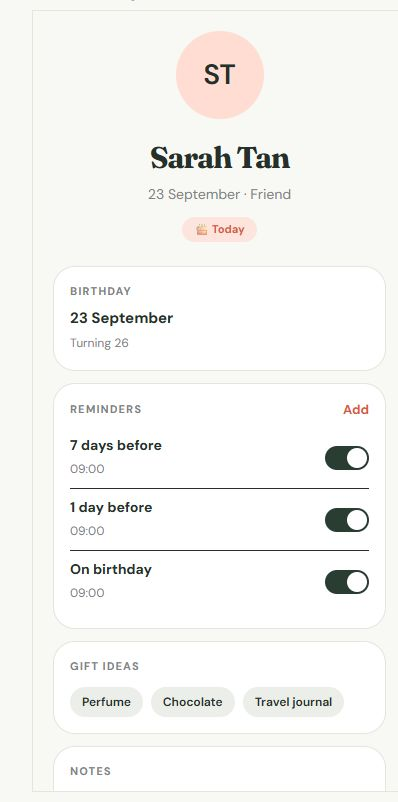
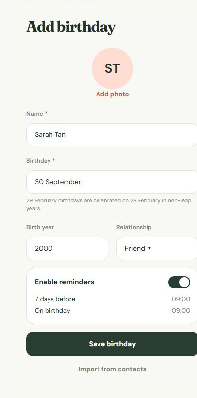
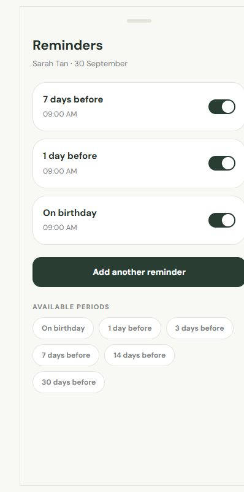
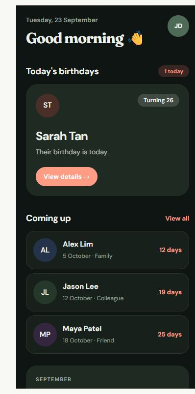

# Birthday Reminder

An Android app that remembers the birthdays you care about and reminds you before the day arrives.

Save a name and a date, add a photo, gift ideas and notes, and let the app keep track. Reminders are
sent as push notifications 30, 14, 7, 3 or 1 day before a birthday — and again on the morning of the
day — based on the timezone you are in.

> **Status:** V1, Android only. There is no Play Store listing and no hosted server you can sign in
> to; you run this project yourself. See [Requirements](#requirements).

## Overview

Most people have the same problem: birthdays live in a phone's contact list, which tells you nothing
until the day has already arrived. Birthday Reminder is built around the opposite idea — a small
server owns the dates and the reminder schedule, and pushes a notification to your phone at the
right moment, even when the app is closed.

From the user's side it is a normal Android app with four tabs:

- **Home** — who has a birthday today, who is coming up, and a summary of the current month.
- **Birthdays** — every saved birthday, searchable and filterable by relationship.
- **Calendar** — the year as a grid, so you can see the busy months at a glance.
- **Settings** — notification preferences, default reminder time, theme, account, and account
  deletion.

Your data lives in your own account, so it follows you to any device you sign in on. It is never
shared with other users of the app.

## Features

- **Reminders that survive a closed app.** A server-side scheduler runs every minute and delivers
  push notifications through Firebase Cloud Messaging; nothing has to be running on the phone.
- **A schedule per birthday.** Add several reminders to the same person — for example 7 days before
  and on the day — each with its own time, and switch any of them off without deleting it.
- **Everything you would want to remember.** Photo, relationship, phone number, email, notes and
  gift ideas, alongside the date and an optional birth year.
- **Today, tomorrow and advance notifications**, each individually switchable, plus a silent or
  audible notification channel.
- **Countdowns that make sense.** Every birthday shows the next occurrence, how many days away it is
  and the age being turned, calculated in your own timezone.
- **29 February handling.** Leap-day birthdays are celebrated on 28 February in non-leap years.
- **Search, filter and sort.** By name, by period (today, this week, this month) and by relationship,
  sorted by soonest, name or recently added.
- **Contact import.** Pick individual contacts to bring in; only the ones you select are uploaded,
  and duplicates are detected before anything is saved.
- **Light and dark themes**, following the system setting or locked on by choice.
- **Works offline.** The last synced data stays readable, with a clear banner and writes disabled
  until the connection returns.
- **Account management.** Sign up, sign in, password reset by email, change password, delete the
  account and everything in it.

## Screenshots

These are captured from the app's design surface in [`design/`](design) — the reference
implementation of the visual language that the Flutter app follows. You can run it yourself in a
minute; see [Look at the interface](#1-look-at-the-interface-fastest).

<table>
  <tr>
    <td align="center"><br><sub>Home</sub></td>
    <td align="center"><br><sub>Birthdays</sub></td>
    <td align="center"><br><sub>Calendar</sub></td>
  </tr>
  <tr>
    <td align="center"><br><sub>Birthday details</sub></td>
    <td align="center"><br><sub>Add a birthday</sub></td>
    <td align="center"><br><sub>Reminders</sub></td>
  </tr>
</table>

The same screens in the dark theme:



## Requirements

| What you want to do | What you need |
| --- | --- |
| Run the app | Flutter 3.41 or newer (Dart 3.11.5+), the Android SDK, and an Android device or emulator running Android 7.0 (API 24) or newer |
| Run the backend locally | Node.js 22 or newer and pnpm (enable it with `corepack enable`) |
| Deploy your own server | A Cloudflare account with Workers, D1 and R2 available |
| Receive push notifications | A Firebase project and its `google-services.json` (optional — see [Configuration](#configuration)) |
| Send password-reset emails | A [Resend](https://resend.com) account (optional) |

Both Cloudflare and Firebase have free tiers that are enough to run this app for personal use.

## Installation

### 1. Look at the interface (fastest)

The design surface runs on its own and needs no backend, account or configuration:

```bash
cd design
pnpm install
pnpm dev
```

Open <http://localhost:8443> to browse every screen, state and theme.

### 2. Run the whole app locally

The app needs a backend to talk to. Start the Worker, then point the app at it.

**Terminal 1 — backend**

```bash
cd backend
pnpm install
cp .dev.vars.example .dev.vars   # sets a local JWT_SECRET; never commit this file
pnpm db:migrate:local
pnpm dev                         # serves the API on http://localhost:8787
```

**Terminal 2 — app on the Android emulator**

```bash
cd app
flutter pub get
flutter run --dart-define=API_BASE_URL=http://10.0.2.2:8787
```

`10.0.2.2` is how the Android emulator reaches your machine; it does not work on a physical phone.
For a real device, start the Worker on all interfaces and use the helper script, which finds your
LAN address, checks the Worker and launches the app:

```powershell
# terminal 1
cd backend
pnpm exec wrangler dev --ip 0.0.0.0 --port 8787

# terminal 2
powershell -ExecutionPolicy Bypass -File scripts/dev-phone.ps1
```

Debug builds allow plain HTTP for this workflow. Release builds do not, so they must be pointed at an
`https://` API.

### 3. Build an installable APK

```bash
cd app
flutter build apk --release \
  --dart-define=API_BASE_URL=https://YOUR_WORKER_URL \
  --dart-define=APP_VERSION=1.0.0
```

The APK is written to `app/build/app/outputs/flutter-apk/app-release.apk`. Without a release keystore
it is signed with the debug keys, which is fine for personal use but not for store distribution; see
the [deployment runbook](docs/deployment.md) for signing.

### 4. Deploy your own server

The backend is a Cloudflare Worker with a D1 database, an R2 bucket for photos and a cron trigger for
the reminder engine. The full walkthrough, including the secrets each environment needs, is in the
[deployment runbook](docs/deployment.md).

## Configuration

Nothing needs configuring to run the checks or the design surface. These values matter when you run
the app against a real backend.

**Backend secrets** live in `backend/.dev.vars` for local development (start from
`backend/.dev.vars.example`) and in `wrangler secret` when deployed. The filled-in file is gitignored
— keep it that way.

| Variable | Required | Purpose |
| --- | --- | --- |
| `JWT_SECRET` | Yes | Signs access tokens. Use a long random string, and never reuse one between environments. |
| `FCM_SERVICE_ACCOUNT` | No | Firebase service-account JSON on a single line. Without it, reminders are still scheduled and logged, but no push is delivered. |
| `RESEND_API_KEY` | No | Enables password-reset emails. Without it, reset links are written to the Worker log instead. |
| `EMAIL_FROM` | No | The sender address for those emails, for example `Birthday Reminder <noreply@example.com>`. |

**App values** are compile-time:

| Value | Purpose |
| --- | --- |
| `--dart-define=API_BASE_URL=...` | The backend the app calls. Defaults to `http://10.0.2.2:8787` for local development. |
| `--dart-define=APP_VERSION=...` | The version string shown in the app. |

**Files each checkout supplies for itself**, all gitignored:

| Path | Purpose |
| --- | --- |
| `app/android/app/google-services.json` | Firebase Android configuration. Only needed for push notifications; the Gradle plugin is applied only when the file is present, so the app builds without it. |
| `app/android/key.properties` and the keystore it points at | Release signing. Without them, release builds fall back to the debug keys. |

## Usage

1. **Create an account.** Register with a name, email and password. The app records your timezone so
   reminders arrive at the time you expect.
2. **Add a birthday.** Only a name and a date are required. Add a photo, relationship, phone number,
   email, notes or gift ideas if you want them.
3. **Set the reminders.** Each birthday starts with a sensible default and can hold several
   reminders — 30, 14, 7, 3 or 1 day before, or on the day — each at a time you choose.
4. **Wait for the notification.** The server checks the schedule every minute and pushes through
   Firebase, so the reminder arrives whether or not the app is open. Tapping it opens that person's
   page.
5. **Everything else.** Search or filter the list, browse the calendar, import birthdays from your
   contacts, switch the theme, and manage the account from Settings.

## Limitations

- **Android only.** There is no iOS project, and the app is not published on Google Play.
- **You run the backend.** There is no hosted service to point the app at; each user deploys their
  own Worker, D1 database and R2 bucket.
- **Push needs your own Firebase project.** Without `google-services.json` and the service account
  the app works, but notifications are only recorded, not delivered.
- **Password-reset email needs a mail provider.** Without a Resend key, reset links are logged rather
  than sent.
- **One user, one account.** Birthdays belong to a single account; there is no sharing or family
  plan.
- **Reminders are minute-accurate**, which is what the cron trigger allows; they are not scheduled to
  the second.
- **AI birthday wishes are deliberately out of scope** for V1.

## What is in the repository

| Path | Contents |
| --- | --- |
| [`app/`](app) | The Flutter Android app. |
| [`backend/`](backend) | The Cloudflare Worker API, D1 migrations and the cron reminder engine. |
| [`design/`](design) | The design surface the app was built to match — a runnable React prototype, not shipped code. |
| [`docs/`](docs) | API reference, architecture notes and the deployment runbook. |
| [`scripts/`](scripts) | Helper scripts for running the app against a local Worker. |

## Documentation

- [Architecture](docs/architecture.md) — how the app, Worker, database and reminder engine fit together.
- [API reference](docs/api.md) — every endpoint, its payloads and its error codes.
- [Deployment runbook](docs/deployment.md) — Cloudflare and Android release steps.
- [Contributing](CONTRIBUTING.md) — branch names, checks and conventions.

## License

Released under the [MIT License](LICENSE). You are free to use, modify and redistribute this project,
including commercially, as long as the copyright notice and licence text are kept with it.
